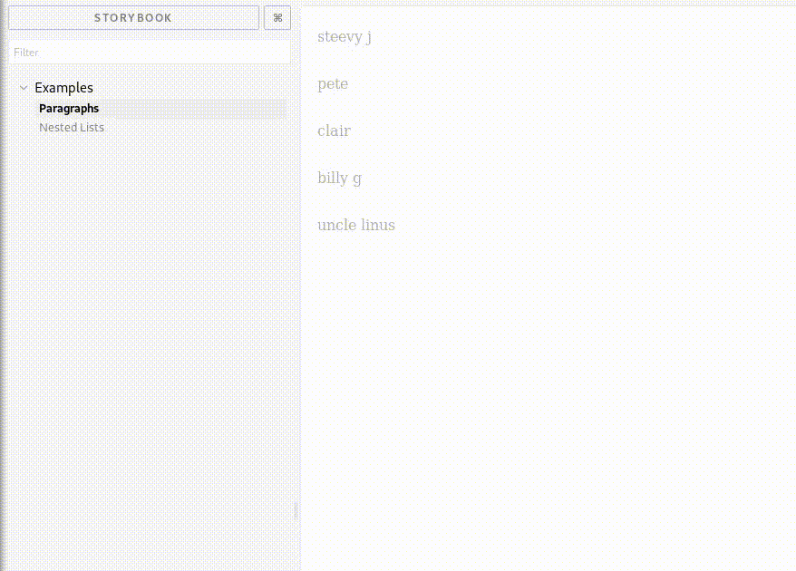

# react-multi-select

React components that provide multiple selection logic. Features mouse and keyboard selections. Can render arbitary tags as selectable items.



```shell
# install dependencies
yarn

# build production bundle
yarn build

# run the tests
yarn test

# examples
yarn examples
```

### Examples
1. [selectable paragraphs](./examples/stories/selectable-paragraphs/index.jsx)
2. [tree view](./examples/stories/nested-lists/index.jsx)

